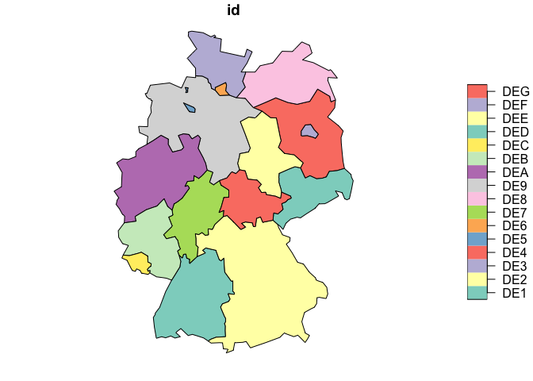
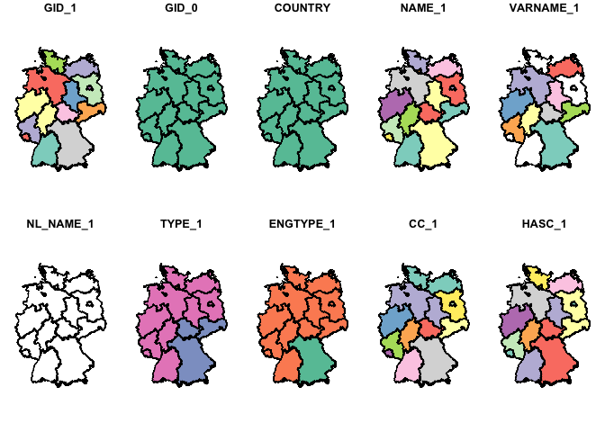
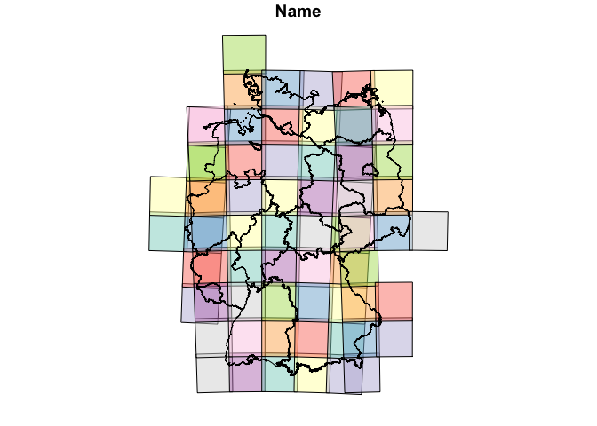
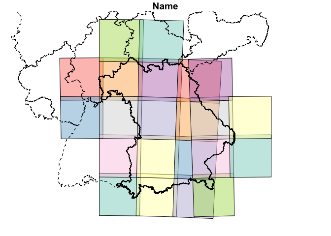

<!-- README.md is generated from README.Rmd. Please edit that file -->

# Using NUTS data in R

NUTS is a FAO unified code system for the administrative regions of the
world.

It can be accessed via the `cartography` package .

``` r
library(sf)
nuts <- st_as_sf(cartography::nuts1.spdf)
DE <- nuts[grepl("DE", nuts$id), ]
plot(DE)
```

<!-- -->

Another alternative is to use `geodata` package. This function et
geographic data for anywhere in the world. Data are read from files that
are first downloaded if necessary.

``` r
DE <- st_as_sf(geodata::gadm(country = "DE", level = 1, path = "."))
plot(DE)
```

<!-- -->

``` r

head(DE)
#> Simple feature collection with 6 features and 11 fields
#> Geometry type: GEOMETRY
#> Dimension:     XY
#> Bounding box:  xmin: 7.51159 ymin: 47.2707 xmax: 14.7657 ymax: 53.9632
#> Geodetic CRS:  WGS 84
#>     GID_1 GID_0 COUNTRY            NAME_1 VARNAME_1 NL_NAME_1
#> 1 DEU.1_1   DEU Germany Baden-Württemberg      <NA>      <NA>
#> 2 DEU.2_1   DEU Germany            Bayern   Bavaria      <NA>
#> 3 DEU.3_1   DEU Germany            Berlin      <NA>      <NA>
#> 4 DEU.4_1   DEU Germany       Brandenburg      <NA>      <NA>
#> 5 DEU.5_1   DEU Germany            Bremen      <NA>      <NA>
#> 6 DEU.6_1   DEU Germany           Hamburg      <NA>      <NA>
#>                 TYPE_1  ENGTYPE_1 CC_1 HASC_1 ISO_1
#> 1                 Land      State   08  DE.BW  <NA>
#> 2            Freistaat Free State   09  DE.BY DE-BY
#> 3                 Land      State   11  DE.BE DE-BE
#> 4                 Land      State   12  DE.BR DE-BB
#> 5     Freie Hansestadt      State   04  DE.HB DE-HB
#> 6 Freie und Hansestadt      State   02  DE.HH DE-HH
#>                         geometry
#> 1 MULTIPOLYGON (((8.350021 47...
#> 2 POLYGON ((11.41009 47.4954,...
#> 3 POLYGON ((13.50022 52.61379...
#> 4 MULTIPOLYGON (((13.3222 51....
#> 5 MULTIPOLYGON (((8.675012 53...
#> 6 MULTIPOLYGON (((10.17575 53...
```

# Sentinel-2 tiles

``` r
if (!file.exists("tiles.rda")) {
        # read tile geometries from:
        # https://sentinel.esa.int/web/sentinel/missions/sentinel-2/data-products
        tiles = read_sf("https://sentinel.esa.int/documents/247904/1955685/S2A_OPER_GIP_TILPAR_MPC__20151209T095117_V20150622T000000_21000101T000000_B00.kml")
        tiles = st_zm(st_collection_extract(tiles, "POLYGON"))
        tiles$Description = NULL
        tiles = aggregate(tiles, list(Name = tiles$Name), function(x) x[1])
        save(tiles, file = "tiles.rda")
} else
        load("tiles.rda")
```

``` r
tiles
#> Simple feature collection with 56686 features and 2 fields
#> Attribute-geometry relationships: aggregate (1), identity (1)
#> Geometry type: GEOMETRY
#> Dimension:     XY
#> Bounding box:  xmin: -180 ymin: -83.83595 xmax: 180 ymax: 84.64428
#> Geodetic CRS:  WGS 84
#> First 10 features:
#>     Name Name.1                       geometry
#> 1  01CCV  01CCV MULTIPOLYGON (((-179.6274 -...
#> 2  01CDH  01CDH MULTIPOLYGON (((-176.2974 -...
#> 3  01CDJ  01CDJ MULTIPOLYGON (((-176.3753 -...
#> 4  01CDK  01CDK MULTIPOLYGON (((-176.4374 -...
#> 5  01CDL  01CDL MULTIPOLYGON (((-176.4882 -...
#> 6  01CDM  01CDM MULTIPOLYGON (((-176.5305 -...
#> 7  01CDN  01CDN MULTIPOLYGON (((-176.5662 -...
#> 8  01CDP  01CDP MULTIPOLYGON (((-176.5968 -...
#> 9  01CDQ  01CDQ MULTIPOLYGON (((-176.6233 -...
#> 10 01CDR  01CDR MULTIPOLYGON (((-176.6464 -...
tiles = tiles[DE,]
col <- sf.colors(categorical=TRUE, alpha=.5)
plot(tiles[,1], reset = FALSE, col = col)
plot(DE, add = TRUE, col = NA)
```

<!-- -->

``` r
tiles
#> Simple feature collection with 69 features and 2 fields
#> Attribute-geometry relationships: aggregate (1), identity (1)
#> Geometry type: POLYGON
#> Dimension:     XY
#> Bounding box:  xmin: 4.408715 ymin: 46.79367 xmax: 16.57954 ymax: 55.94564
#> Geodetic CRS:  WGS 84
#> First 10 features:
#>        Name Name.1                       geometry
#> 29305 31UFS  31UFS POLYGON ((4.438877 51.44235...
#> 29306 31UFT  31UFT POLYGON ((4.467884 52.34136...
#> 29310 31UGQ  31UGQ POLYGON ((5.768515 49.61961...
#> 29311 31UGR  31UGR POLYGON ((5.820769 50.51811...
#> 29312 31UGS  31UGS POLYGON ((5.875717 51.4159,...
#> 29313 31UGT  31UGT POLYGON ((5.933616 52.31404...
#> 29314 31UGU  31UGU POLYGON ((5.994641 53.21199...
#> 29315 31UGV  31UGV POLYGON ((6.058983 54.10922...
#> 30186 32TLT  32TLT POLYGON ((6.327927 47.8226,...
#> 30195 32TMT  32TMT POLYGON ((7.662865 47.84591...
DE
#> Simple feature collection with 16 features and 11 fields
#> Geometry type: GEOMETRY
#> Dimension:     XY
#> Bounding box:  xmin: 5.866251 ymin: 47.2707 xmax: 15.04181 ymax: 55.05653
#> Geodetic CRS:  WGS 84
#> First 10 features:
#>       GID_1 GID_0 COUNTRY                 NAME_1                  VARNAME_1
#> 1   DEU.1_1   DEU Germany      Baden-Württemberg                       <NA>
#> 2   DEU.2_1   DEU Germany                 Bayern                    Bavaria
#> 3   DEU.3_1   DEU Germany                 Berlin                       <NA>
#> 4   DEU.4_1   DEU Germany            Brandenburg                       <NA>
#> 5   DEU.5_1   DEU Germany                 Bremen                       <NA>
#> 6   DEU.6_1   DEU Germany                Hamburg                       <NA>
#> 7   DEU.7_1   DEU Germany                 Hessen                      Hesse
#> 8   DEU.8_1   DEU Germany Mecklenburg-Vorpommern Mecklenburg-West Pomerania
#> 9   DEU.9_1   DEU Germany          Niedersachsen               Lower Saxony
#> 10 DEU.10_1   DEU Germany    Nordrhein-Westfalen     North Rhine-Westphalia
#>    NL_NAME_1               TYPE_1  ENGTYPE_1 CC_1 HASC_1 ISO_1
#> 1       <NA>                 Land      State   08  DE.BW  <NA>
#> 2       <NA>            Freistaat Free State   09  DE.BY DE-BY
#> 3       <NA>                 Land      State   11  DE.BE DE-BE
#> 4       <NA>                 Land      State   12  DE.BR DE-BB
#> 5       <NA>     Freie Hansestadt      State   04  DE.HB DE-HB
#> 6       <NA> Freie und Hansestadt      State   02  DE.HH DE-HH
#> 7       <NA>                 Land      State   06  DE.HE DE-HE
#> 8       <NA>                 Land      State   13  DE.MV DE-MV
#> 9       <NA>                 Land      State   03  DE.NI DE-NI
#> 10      <NA>                 Land      State   05  DE.NW DE-NW
#>                          geometry
#> 1  MULTIPOLYGON (((8.350021 47...
#> 2  POLYGON ((11.41009 47.4954,...
#> 3  POLYGON ((13.50022 52.61379...
#> 4  MULTIPOLYGON (((13.3222 51....
#> 5  MULTIPOLYGON (((8.675012 53...
#> 6  MULTIPOLYGON (((10.17575 53...
#> 7  MULTIPOLYGON (((8.886135 49...
#> 8  MULTIPOLYGON (((11.56936 53...
#> 9  MULTIPOLYGON (((10.36772 51...
#> 10 POLYGON ((6.579563 50.37709...
```

``` r
joined <- st_join(DE, tiles)
joined
#> Simple feature collection with 157 features and 13 fields
#> Geometry type: GEOMETRY
#> Dimension:     XY
#> Bounding box:  xmin: 5.866251 ymin: 47.2707 xmax: 15.04181 ymax: 55.05653
#> Geodetic CRS:  WGS 84
#> First 10 features:
#>       GID_1 GID_0 COUNTRY            NAME_1 VARNAME_1 NL_NAME_1 TYPE_1
#> 1   DEU.1_1   DEU Germany Baden-Württemberg      <NA>      <NA>   Land
#> 1.1 DEU.1_1   DEU Germany Baden-Württemberg      <NA>      <NA>   Land
#> 1.2 DEU.1_1   DEU Germany Baden-Württemberg      <NA>      <NA>   Land
#> 1.3 DEU.1_1   DEU Germany Baden-Württemberg      <NA>      <NA>   Land
#> 1.4 DEU.1_1   DEU Germany Baden-Württemberg      <NA>      <NA>   Land
#> 1.5 DEU.1_1   DEU Germany Baden-Württemberg      <NA>      <NA>   Land
#> 1.6 DEU.1_1   DEU Germany Baden-Württemberg      <NA>      <NA>   Land
#> 1.7 DEU.1_1   DEU Germany Baden-Württemberg      <NA>      <NA>   Land
#> 1.8 DEU.1_1   DEU Germany Baden-Württemberg      <NA>      <NA>   Land
#> 1.9 DEU.1_1   DEU Germany Baden-Württemberg      <NA>      <NA>   Land
#>     ENGTYPE_1 CC_1 HASC_1 ISO_1  Name Name.1                       geometry
#> 1       State   08  DE.BW  <NA> 32TLT  32TLT MULTIPOLYGON (((8.350021 47...
#> 1.1     State   08  DE.BW  <NA> 32TMT  32TMT MULTIPOLYGON (((8.350021 47...
#> 1.2     State   08  DE.BW  <NA> 32TNT  32TNT MULTIPOLYGON (((8.350021 47...
#> 1.3     State   08  DE.BW  <NA> 32ULU  32ULU MULTIPOLYGON (((8.350021 47...
#> 1.4     State   08  DE.BW  <NA> 32UMA  32UMA MULTIPOLYGON (((8.350021 47...
#> 1.5     State   08  DE.BW  <NA> 32UMU  32UMU MULTIPOLYGON (((8.350021 47...
#> 1.6     State   08  DE.BW  <NA> 32UMV  32UMV MULTIPOLYGON (((8.350021 47...
#> 1.7     State   08  DE.BW  <NA> 32UNA  32UNA MULTIPOLYGON (((8.350021 47...
#> 1.8     State   08  DE.BW  <NA> 32UNU  32UNU MULTIPOLYGON (((8.350021 47...
#> 1.9     State   08  DE.BW  <NA> 32UNV  32UNV MULTIPOLYGON (((8.350021 47...
```

``` r
bayern <- joined[joined$NAME_1 == "Bayern", 1]

plot(tiles[bayern, 1], reset = FALSE, col = col)
plot(DE, add = TRUE, col = NA, lty = 2)
plot(bayern, add = TRUE , col = NA)
```

<!-- -->

``` r
readr::write_csv(sf::st_drop_geometry(joined), "joined.csv")
```
